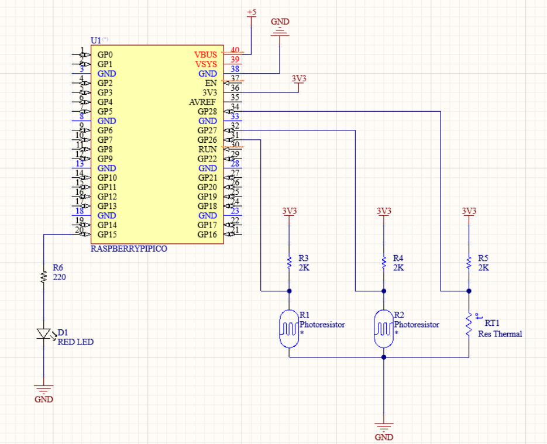

# Smart Window Blinds

## Project Overview

This project aims to develop an automated system for controlling smart glass windows to reduce internal heat and light pollution. The system uses sensors to detect internal and external ambient heat and light levels, and automatically toggles electronically switchable smart glass accordingly. It also allows for on-demand switching at the user's convenience.

## Team Members

- Benjamin Blake
- Mohammed Akram Khan Lodi
- Kaleb Manton

## Problem Statement

As technology progresses, there is an increasing need for automation to enhance our quality of life. Our project focuses on addressing the problem of heat accumulation from expansive windows. We believe that through the creation of a straightforward automated sensor system, we can reduce heating costs and improve comfort levels within buildings featuring large windows.

## Proposed Solution

Our solution involves developing an automated system that:

1. Detects internal and external ambient heat
2. Measures external light levels
3. Toggles electronically switchable smart glass based on these readings
4. Allows for manual control when needed

### Components

- 2 x Thermistors (for internal and external heat detection)
- 1 x Photoresistor (for external light level detection)
- 1 x Yellow LED (to indicate manual mode)
- 1 x Green LED (to indicate sentry mode)
- Various resistors (for sensor sensitivity adjustment)
- Raspberry Pi Pico (for system control)

## Technical Details

### Circuit Schematic


This schematic shows the connections between the Raspberry Pi Pico, sensors, and LED actuator.

### MicroPython Code

The main control logic is implemented in MicroPython. Key features include:

- ADC reading for sensors
- Control logic for smart glass activation
- LED status indicators
- Wireless communication for remote monitoring and control

### User Interface

The project includes a web-based user interface that allows users to:

- View current system status
- Monitor sensor readings
- Manually activate or deactivate the smart glass

## Setup and Installation

1. Clone the repository:
   ```
   git clone https://github.com/akramlodi/Smart-window-blinds.git
   cd smart-window-blinds
   ```

2. Set up the Raspberry Pi Pico:
   - Install MicroPython on your Raspberry Pi Pico if you haven't already.
   - Copy the `RPI_pico_code/window_blind.py` file to your Raspberry Pi Pico.

3. Configure the hardware:
   - Connect the sensors and LEDs to your Raspberry Pi Pico according to the following pin configuration:
     - Inside Photoresistor: Pin 26
     - Outside Photoresistor: Pin 27
     - Thermistor: Pin 28
     - Red LED (actuator): Pin 15

## Usage

1. Power on your Raspberry Pi Pico:
   - The `window_blind.py` script will start automatically.
   - The Pico will create a Wi-Fi access point named "SMART_BLINDS" with the password "123456789".

2. Connect to the Pico's Wi-Fi network:
   - On your computer or mobile device, connect to the "SMART_BLINDS" Wi-Fi network.

3. Access the web interface:
   - Open a web browser and go to `http://192.168.4.1` (this is the default IP for the Pico's access point).
   - You should see the Smart Window Blinds control interface.

4. Using the interface:
   - View the current status of your smart window blinds (Activated/Disabled).
   - Monitor the internal and external light sensor readings.
   - Check the current temperature.
   - Use the "Activate" and "Disable" buttons to manually control the smart glass.

5. Automatic operation:
   - The system will automatically adjust the smart glass based on the sensor readings.
   - The Red LED indicates when the smart glass is activated (on) or disabled (off).

Note: The system creates its own Wi-Fi network, so you don't need to connect it to an existing network. However, this means you'll need to be within range of the Pico's Wi-Fi signal to access the control interface.

## Customization

You can modify the following parameters in the `window_blind.py` file:

- `threshold_brightness`: Adjust this value to change the light level threshold for activating the smart glass.
- `ssid` and `password`: Change these to set a custom Wi-Fi network name and password.


## Future Improvements

- Enhance the user interface to make it more accessible and user-friendly
- Implement remote access functionality to control the window blinds from anywhere
- Integrate with smart home systems for seamless automation
- Develop a mobile application for easy control on smartphones and tablets
- Implement machine learning algorithms to predict and optimize energy savings
- Add voice control capabilities for hands-free operation

## Contributing

This project is part of an engineering design course (ENGR 120). While we're not actively seeking contributions, we appreciate any feedback or suggestions.

## Acknowledgments

- Our lab TA and instructors for their guidance.

